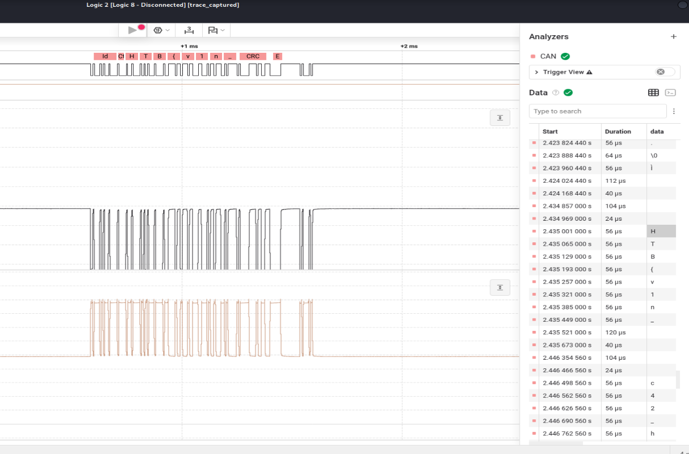

Unique – Write-up
==========================

Challenge Overview
------------------
The challenge provided a `.sal` file generated by a Saleae Logic analyzer.  
The objective was to analyze the captured automotive network traffic and extract the VIN / flag transmitted over the bus.

Initial Analysis
----------------
The `.sal` file was opened using Logic 2.  
The capture revealed two complementary signals, indicating a differential communication protocol.

Protocol Identification
-----------------------
The observed signals showed:
- Opposite transitions between two lines
- Stable idle state
- Dominant and recessive behavior

These characteristics match the Controller Area Network (CAN) protocol, which uses differential signaling (CAN_H and CAN_L).

Reference:
https://www.circuitbread.com/tutorials/understanding-can-a-beginners-guide-to-the-controller-area-network-protocol

Signal Decoding
---------------
A CAN analyzer was added in Logic 2.

Common bitrates were tested:
- 1 Mbps
- 500 kbps
- 250 kbps

None produced valid decoded frames.

Bitrate Determination
---------------------
The bit duration was measured directly from the waveform:

- Bit time ≈ 7.8 µs

Using:
bitrate = 1 / bit_time

bitrate ≈ 1 / (7.8 × 10^-6) ≈ 128 kbps

The closest standard CAN bitrate is 125 kbps.

Successful Decoding
-------------------
After setting the bitrate to 125000 bits/s, the CAN frames were correctly decoded.

Flag Extraction
---------------
The decoded CAN payload contained readable ASCII data.

The flag was directly visible:

HTB{...}

Capture from Logic 2:

CAN Protocol Context
--------------------
CAN is a message-based protocol used in automotive systems:
- Differential signaling (CAN_H / CAN_L)
- Broadcast communication model
- High reliability in noisy environments
- Maximum payload of 8 bytes (classic CAN)

Conclusion
----------
- The capture contained CAN bus communication
- The bitrate was determined via timing analysis
- Correct bitrate: 125 kbps
- The flag was extracted from the decoded payload

Key Takeaways
-------------
- Voltage alone cannot determine bitrate
- Bit timing measurement is reliable
- Correct analyzer configuration is critical
- Logic analyzers are essential for embedded reverse engineering
